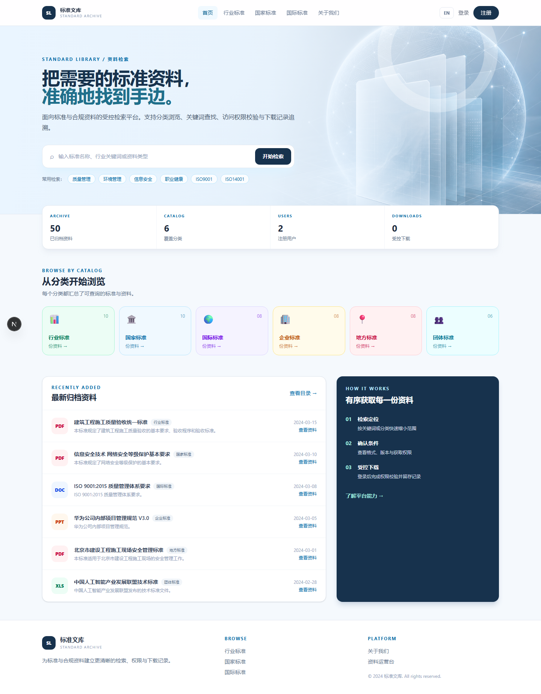
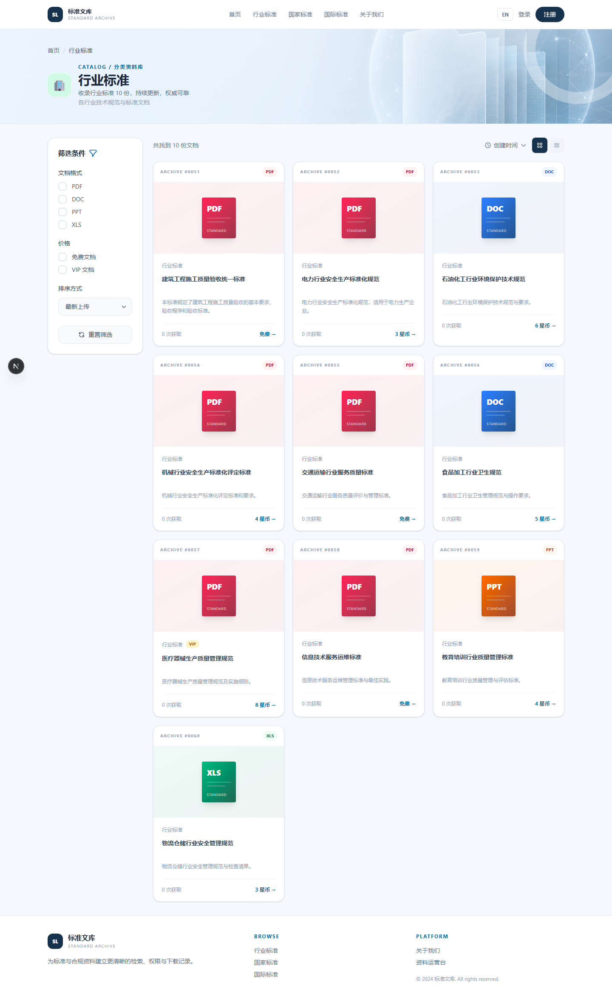
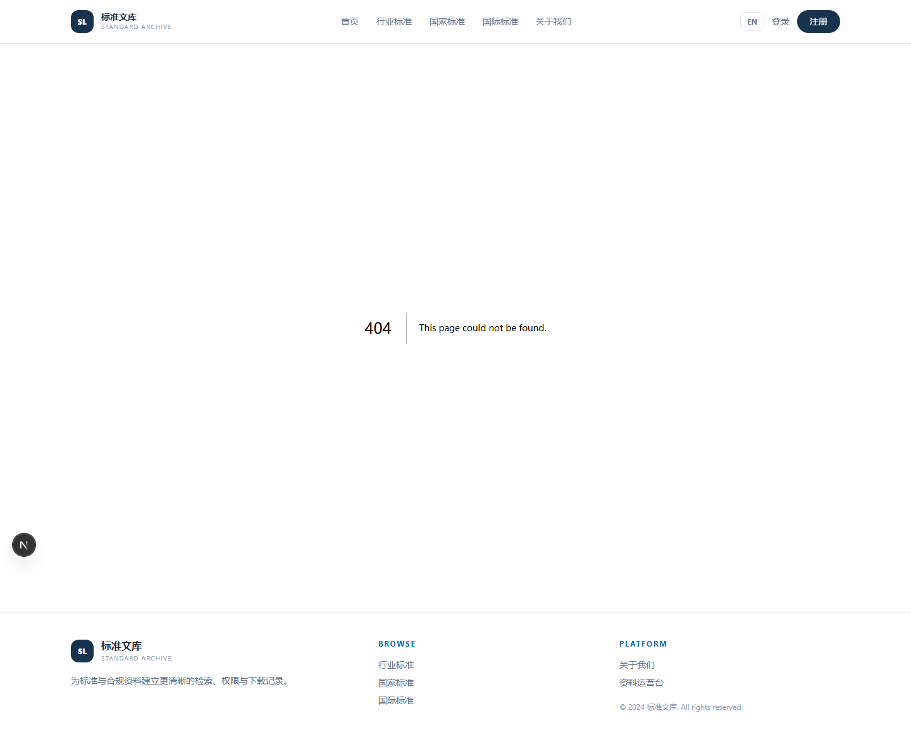
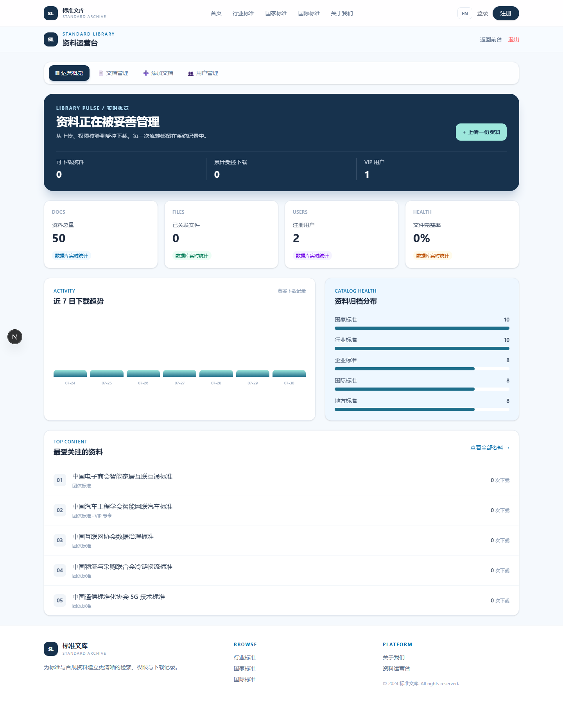

# 标准文库

一个面向标准与合规资料管理的全栈应用。管理员在后台维护资料与文件，用户按登录状态、VIP 权限和星币余额获取内容；下载行为写入 MySQL，便于查询与审计。

项目用于展示 Next.js、MySQL、Prisma、服务端鉴权和文件生命周期管理在同一业务场景下的组合使用。

## 功能

| 模块 | 说明 |
| --- | --- |
| 资料检索 | 按分类和关键词浏览资料，支持格式、价格和 VIP 条件筛选。 |
| 资料详情 | 展示文件格式、页数、大小、上传时间、下载次数和访问条件。 |
| 受控下载 | 服务端校验登录、VIP 与星币余额；成功后记录下载并返回私有文件流。 |
| 管理后台 | 提供运营概览、资料管理、文件上传/替换、用户列表。 |
| 数据看板 | 统计资料、文件、用户、VIP、下载趋势、分类分布和热门资料。 |
| 文件管理 | 支持 PDF、Word、Excel、PPT；校验 MIME 类型与 20MB 大小限制。 |

## 页面预览

### 首页



### 分类资料库



### 资料详情



### 管理后台



截图使用本地 MySQL 演示数据生成；图中的后台、筛选和下载入口均为实际页面，而非静态设计稿。

## 技术实现

```text
Browser
  │
  ▼
Next.js App Router
  ├─ Server Components / Route Handlers
  ├─ JWT + HttpOnly Cookie
  ├─ Prisma ORM
  ├─ Private document storage
  └─ MySQL 8
```

- Next.js 16、React 19、TypeScript、Tailwind CSS 4
- MySQL 8、Prisma ORM 7
- jose、bcryptjs
- Vitest、GitHub Actions

## 本地运行

### 环境要求

- Node.js 20 或更高版本
- MySQL 8

### 1. 安装依赖

```powershell
npm install
```

### 2. 配置环境变量

复制示例文件并填写本地数据库配置：

```powershell
Copy-Item .env.example .env.local
```

`.env.local` 示例：

```env
DATABASE_URL="mysql://用户名:密码@localhost:3306/standard_library"
JWT_SECRET="请替换为随机生成的长字符串"
ADMIN_PASSWORD="后台登录密码"
```

### 3. 初始化数据库

先在 MySQL 中创建数据库 `standard_library`，再执行迁移：

```powershell
npx prisma migrate deploy
npx prisma generate
```

如需导入旧版 SQLite 演示数据，可额外执行：

```powershell
npm run db:import
```

### 4. 启动应用

```powershell
npm run dev
```

- 用户端：`http://localhost:3000`
- 管理后台：`http://localhost:3000/admin`
- 数据库可视化：`npx prisma studio`

## 关键业务流程

```text
管理员上传资料
  → 服务端校验文件格式、MIME 类型和大小
  → 写入私有文件目录，并保存 MySQL 元数据

用户请求下载
  → 校验登录、VIP 权限和星币余额
  → 创建下载记录、更新计数
  → 返回受控文件流
```

文件默认保存在 `storage/documents/`，用于本地运行和演示。该目录不进入 Git；生产环境可将 `src/lib/document-storage.ts` 替换为对象存储实现。

## 常用命令

```powershell
npm run dev          # 启动开发服务器
npm run test         # 运行单元测试
npm run build        # 生产构建和类型检查
npm run db:import    # 导入旧版 SQLite 演示数据
npx prisma studio    # 打开 Prisma 数据库管理界面
```

## 工程说明

- GitHub Actions 在 push 和 Pull Request 时执行依赖安装、单元测试和生产构建。
- 管理端接口在服务端校验管理员身份；`.env.local`、上传文件和数据库备份不进入仓库。
